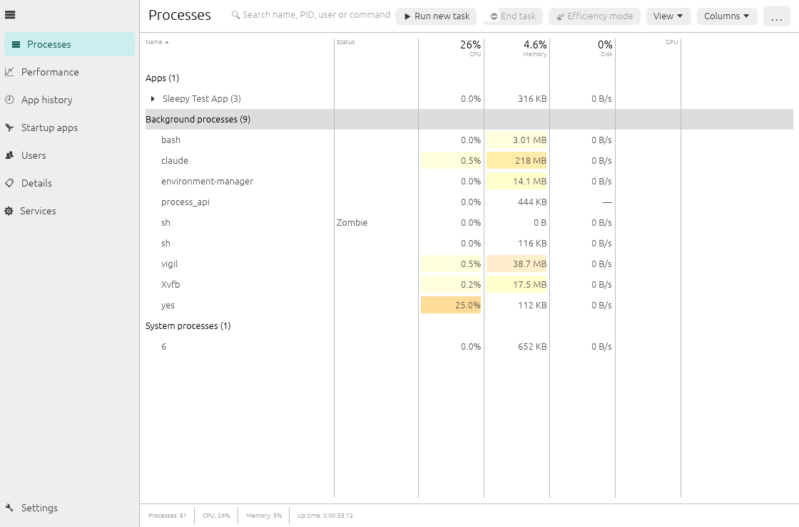
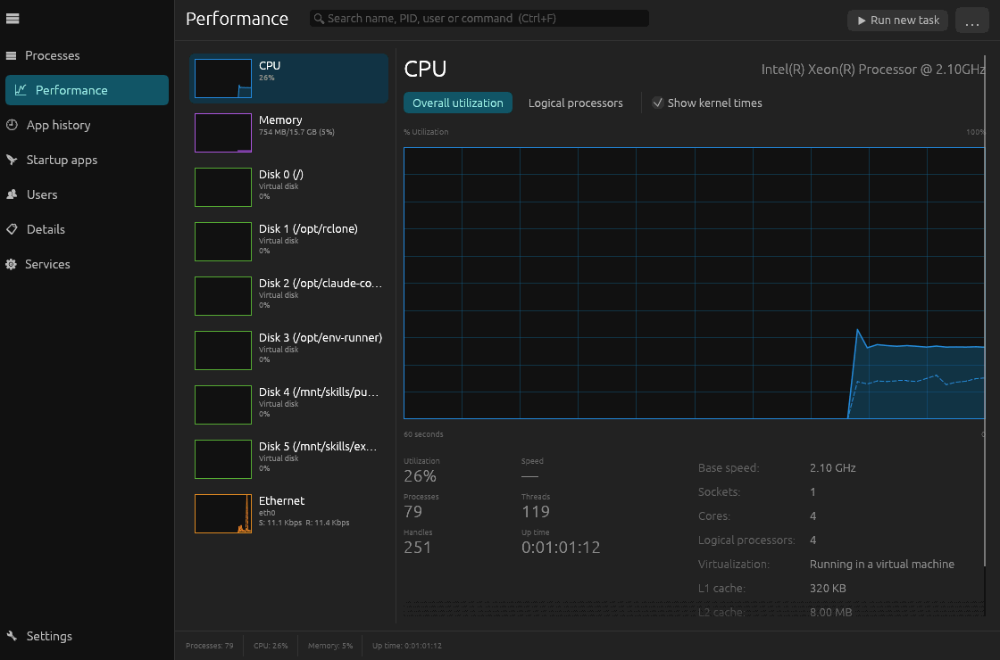

<div align="center">


# Vigil Task Manager

**A fast, free and open source task manager for Linux and Windows — in the style of the Windows Task Manager.**

No subscriptions. No "Pro" tier. No telemetry. No account. Just a task manager.

[](https://github.com/baba537/Vigil-Task-Manager/actions/workflows/ci.yml)
[](LICENSE)




</div>

---

## Why Vigil?

Most Linux system monitors either look nothing like the Windows Task Manager people already know,
or they are closed source / freemium. Vigil aims to be the task manager you would expect —
**Linux first**, also on Windows — while staying:

- **Free forever.** Licensed under the GPL v3 (or later). Every feature is in the free version because there is no other version.
- **Private.** Vigil never connects to the internet. No telemetry, no update pings, no account.
- **Light.** A single native binary (Rust + egui). On a typical system the sampling thread uses well under 1 % of one CPU core at the default update speed; the UI only redraws when there is new data.
- **Stable.** Data collection runs in its own thread and recovers automatically from errors; vanished processes, missing permissions and exotic hardware are handled gracefully instead of crashing.
- **Universal.** Works on X11 and Wayland with GNOME, KDE Plasma, Xfce, Cinnamon, MATE, LXQt, Budgie, COSMIC, Sway, Hyprland, i3 and any other desktop — no toolkit lock-in.

## Features

Vigil covers every page of the Windows Task Manager:

| Page | What you get |
|------|--------------|
| **Processes** | Apps / Background / System grouping, apps expandable to their child processes, heat-map colored CPU, memory, disk and GPU columns with totals in the header, optional PID, status, user, threads, priority, working set, virtual memory, start time and command line columns, instant search. |
| **Performance** | Live graphs for **CPU** (overall or per logical processor, kernel time), **Memory** (usage, composition bar, committed, cached, swap, kernel memory), every **Disk** (active time, read/write throughput, response time), every **Network adapter** (send/receive, IPv4/IPv6, MAC, link speed) and every **GPU** (utilization, dedicated/shared memory, temperature). Speed, processes, threads, handles, up time, base speed, sockets, cores, caches, virtualization, temperature and load average. |
| **App history** | CPU time, disk reads/writes and GPU time accumulated per application, kept across restarts, with "Delete usage history". |
| **Startup apps** | XDG autostart entries and user-enabled systemd user services on Linux; registry *Run* keys and Startup folders on Windows. Enable, disable, add, remove, open file location. Last boot time breakdown (systemd). |
| **Users** | Resource usage per user account, expandable to the user's processes, "End all processes". |
| **Details** | Flat, sortable list of every process with technical columns (CPU time, nice/priority, threads, RSS, virtual memory, start time, command line, ...), kernel threads optional. |
| **Services** | systemd system **and** user services (OpenRC on non-systemd distributions, the Service Control Manager on Windows): status, PID, startup type; start, stop, restart, enable, disable; jump from a process to its service and back. |

Process actions (context menu, toolbar and keyboard):

- **End task** (graceful), **End process tree**, **Kill** (force)
- **Suspend / Resume**
- **Efficiency mode** — lowest CPU priority plus idle I/O class on Linux; EcoQoS + idle priority class on Windows, exactly like Windows 11
- **Set priority**, **Set affinity** (choose CPU cores)
- **Open file location**, **Search online** (DuckDuckGo), **Copy** name / PID / path / command line, **Properties**
- **Run new task**, optionally with administrator rights
- Actions on processes of other users can be **retried as administrator** via polkit (`pkexec`) on Linux or UAC on Windows.

More: light / dark / system theme, zoom, adjustable update speed (0.5 s / 1 s / 4 s / paused), graph history length, always-on-top, per-core or whole-system CPU percentages, column chooser, persistent settings.

### GPU support

| Vendor / driver | Total utilization | Memory | Per-process usage |
|---|---|---|---|
| AMD (`amdgpu`) | ✔ | ✔ VRAM + GTT | ✔ (DRM fdinfo) |
| Intel (`i915`, `xe`) | ✔ (DRM fdinfo) | — | ✔ (DRM fdinfo) |
| NVIDIA (proprietary driver) | ✔ (NVML) | ✔ | ✔ (NVML) |
| NVIDIA (`nouveau`), ARM SoCs (`msm`, `panfrost`, `v3d`, ...) | where the driver exposes DRM fdinfo | — | where exposed |

NVML is loaded at runtime only if present — there is no build-time or run-time dependency on NVIDIA software.
GPU model names come from the system `pci.ids` database (package `hwdata` / `pciutils`).

## Installation

### Linux

Download the latest release from the [Releases page](https://github.com/baba537/Vigil-Task-Manager/releases):

| Distribution | Package |
|---|---|
| Debian, Ubuntu, Linux Mint, Pop!_OS, elementary, Zorin, ... | `vigil-task-manager_<version>_amd64.deb` → `sudo apt install ./vigil-task-manager_*.deb` |
| Fedora, RHEL, Alma, Rocky, openSUSE, ... | `vigil-task-manager-<version>.x86_64.rpm` → `sudo dnf install ./vigil-task-manager-*.rpm` |
| Arch, Manjaro, EndeavourOS, ... | build with the included [`packaging/arch/PKGBUILD`](packaging/arch/PKGBUILD) (`makepkg -si`) |
| Any distribution | `vigil-<version>-linux-x86_64.tar.gz` → extract, then `./install.sh` (user) or `sudo ./install.sh --system` |

Release binaries are linked against **glibc 2.28**, so they run on practically every distribution released since 2018
(Debian 10+, Ubuntu 18.10+, RHEL/Alma/Rocky 8+, Fedora 29+, openSUSE Leap 15.3+, ...). Builds for **x86_64** and **aarch64** are provided.

Runtime requirements (preinstalled on every desktop system): OpenGL 2.0 / OpenGL ES 2.0 (Mesa is fine, including software rendering),
`libxkbcommon` and either X11 or Wayland. Optional: `polkit` for administrator actions, `hwdata` for GPU names.

### Windows

Download `vigil-<version>-windows-x86_64.zip`, extract it and run `vigil.exe`. No installation, no admin rights needed
(administrator actions will show the usual UAC prompt). Windows 10 and 11 are supported.

### Build from source

You need a recent stable Rust toolchain (1.95 or newer, e.g. via [rustup](https://rustup.rs)). No system development libraries are required.

```sh
git clone https://github.com/baba537/Vigil-Task-Manager.git
cd Vigil-Task-Manager
cargo build --release
./target/release/vigil
```

To build without NVIDIA support: `cargo build --release --no-default-features`.

## Usage

```
vigil                      start the GUI
vigil --page performance   start on a page: processes, performance, history, startup, users, details, services, settings
vigil --snapshot           print a one-shot system summary (useful for bug reports) and exit
vigil --help
```

### Keyboard shortcuts

| Shortcut | Action |
|---|---|
| `Ctrl+F` | Search |
| `Esc` | Clear search / close dialog |
| `Delete` / `Shift+Delete` | End task / Kill |
| `↑` `↓` | Move selection |
| `Ctrl+N` | Run new task |
| `F5` | Refresh now |
| `Ctrl+1` … `Ctrl+7` | Switch page |
| `Ctrl+,` | Settings |
| `Ctrl` `+` / `Ctrl` `−` | Zoom |
| `Ctrl+Q` | Quit |

## Platform notes

- **Administrator actions on Linux** use polkit (`pkexec`). Ending, re-prioritizing or pinning processes of other users opens your desktop's authentication dialog.
  Services are controlled through `systemctl`, which asks polkit itself.
- **Service managers:** systemd (system + user services) and OpenRC are supported. On other init systems (runit, s6, ...) everything except the Services page works.
- **Apps vs. background processes on Linux:** Vigil reads the systemd cgroup of each process (GNOME, KDE Plasma, COSMIC and others launch apps into `app-*.scope` units)
  and matches it with the installed `.desktop` files. On systems without systemd, executables are matched against the `.desktop` files instead.
- **Always on top** depends on the window manager; some Wayland compositors do not allow applications to request it.
- **Per-process network usage** is not available on Linux without root-level packet capture, so Vigil does not show it rather than guessing.
- **Why no Flatpak or Snap?** Sandboxed packages cannot see the processes of the host system, which a task manager needs. Native packages are provided instead.
- **Rendering problems** (very old or broken GPU drivers): start with `LIBGL_ALWAYS_SOFTWARE=1 vigil`.

## How it works

```
src/
├── main.rs            entry point, command line
├── app.rs             window shell: navigation, header, status bar, actions, settings
├── sampler.rs         background sampling thread (panic-safe, sleeps between ticks)
├── model.rs           platform independent data model
├── history.rs         graph history and per-app usage accounting
├── settings.rs        persisted preferences
├── platform/
│   ├── linux/         /proc + /sys parsers, DRM fdinfo GPU accounting, XDG autostart, systemd/OpenRC
│   ├── windows/       sysinfo + Win32 (priority, EcoQoS, affinity, services, registry startup)
│   └── nvidia.rs      runtime-loaded NVML
└── ui/                one module per page plus widgets, dialogs and theme
```

On Linux Vigil reads `/proc` and `/sys` directly: per refresh only three small files are read per process
(`stat`, `statm`, `io`); everything that cannot change during a process' lifetime is cached. Snapshots are
produced off the UI thread, the UI caches sorted/grouped rows per snapshot and only renders visible rows.

## Privacy

Vigil does not open any network connection. Settings and app history are stored locally
(`~/.local/share/io.github.baba537.vigil/` on Linux, `%APPDATA%\io.github.baba537.Vigil\data\` on Windows).
"Search online" opens your browser only when you click it.

## Contributing

Bug reports, feature requests and pull requests are welcome! Please read [CONTRIBUTING.md](CONTRIBUTING.md).
When reporting a bug, include the output of `vigil --snapshot` and your distribution / desktop environment.

## License

Vigil is free software: you can redistribute it and/or modify it under the terms of the
[GNU General Public License](LICENSE) as published by the Free Software Foundation, either version 3 of the License,
or (at your option) any later version. This guarantees that Vigil — and any fork of it — stays open source.
